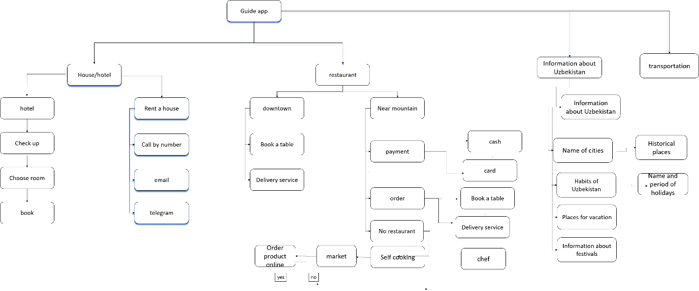
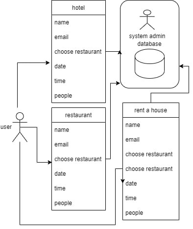
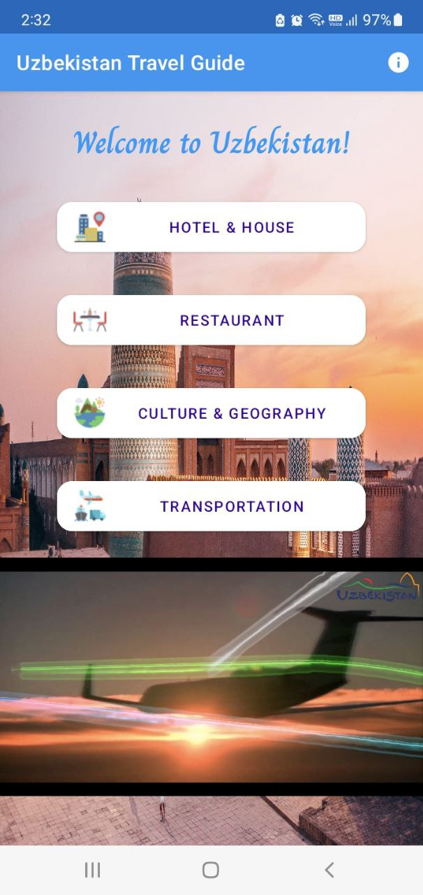
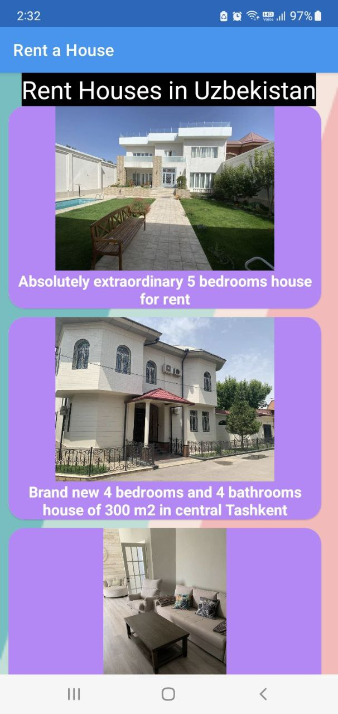
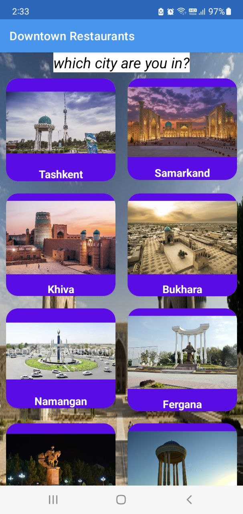
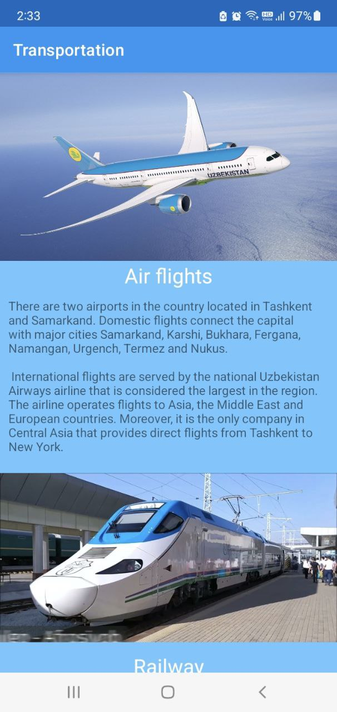
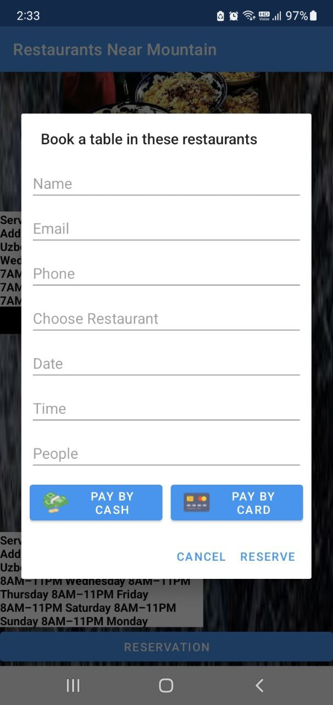
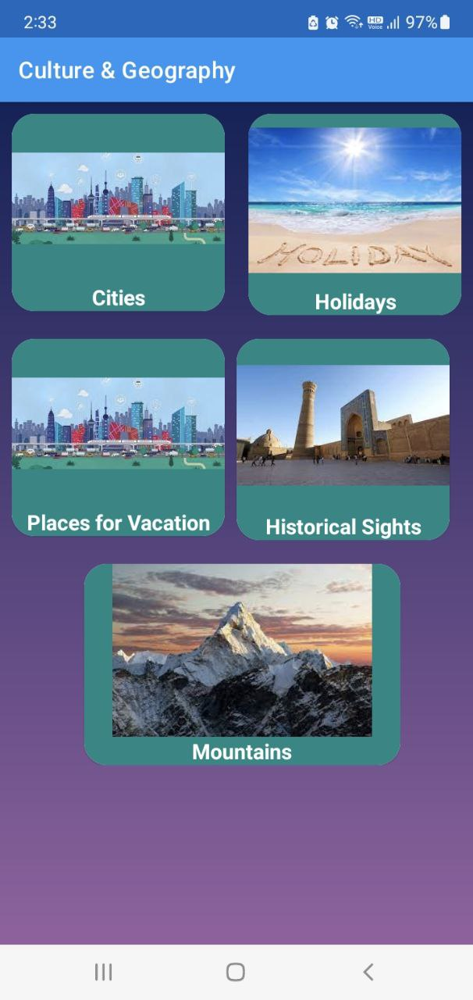
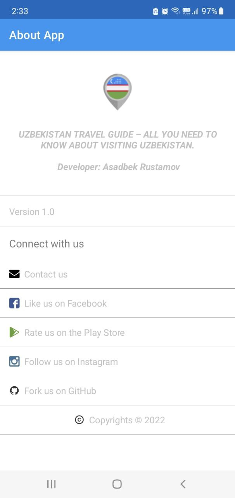

<h1>
‘Guide app’ – Travel Application for Uzbekistan
</h1> 

Rustamov Asadbek (Prof. Young Sil Lee)
 

<b>Abstract</b> 
Nowadays a lot of visitors facing on a problem when they travel another country and even if there are some websites to book a place like restaurant and hotel it does not consider every place about that country, like to travel and some information about their culture. In this this app I considered some information about my country. I did some research found information for visitors to Uzbekistan and figured out common problems. The results of this study show that personalization and context awareness play an important part in mobile application development. When it comes to functionality of a mobile application designed for supporting tourists and it seems like different map and information retrieval functions are the most important, while social functions such as integration with social networks and communication with friends are less favored 
<b>Keyword:</b> <i>searching (restaurant, hotel, sightseeing places), mobile app, Uzbekistan</i>

<table>
	<tr>
		<td>
			
		</td>
		<td>
			
		</td>
	</tr>
	<tr>
		<td>
			
		</td>
		<td>
			
		</td>
	</tr>
	<tr>
		<td>
			
		</td>
		<td>
			
		</td>
		<td>
			
		</td>
	</tr>
</table>